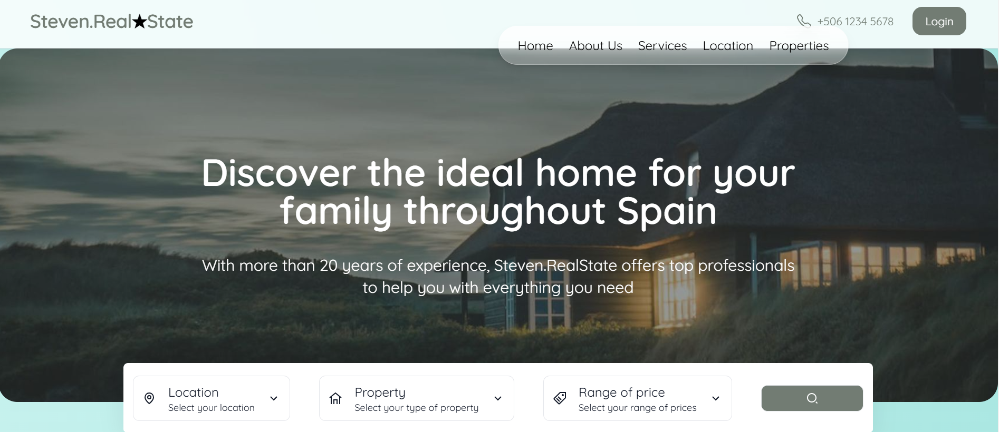

# 🏡 Real Estate - Steven

A modern and elegant real estate web application built with **Next.js 14**, **TypeScript**, **TailwindCSS**, and **Framer Motion**. This project showcases properties with a clean UI, search functionality, page transitions, and interactive maps using Leaflet.

---

## 📸 Preview

 

---

## 🚀 Features

- ✅ Built with **Next.js App Router**
- 🎨 Fully responsive design using **TailwindCSS**
- 🌙 Light & Dark mode ready *(optional enhancement)*
- 🗺️ **Interactive Map** with Leaflet and React-Leaflet
- 💡 Elegant **page transitions** with Framer Motion
- 📦 Floating search bar with filters for:
  - Location
  - Property type
  - Price range
- 📱 Mobile menu with responsive behavior
- 🔍 SEO-friendly page metadata
- 💻 Fully typed with **TypeScript**
- 💬 Minimalistic & polished UI with smooth UX

---

## 🛠️ Tech Stack

| Tool             | Description                        |
|------------------|------------------------------------|
| [Next.js 14](https://nextjs.org) | React framework for SSR/SSG |
| [Tailwind CSS](https://tailwindcss.com) | Utility-first CSS framework |
| [TypeScript](https://www.typescriptlang.org/) | Typed JavaScript |
| [Framer Motion](https://www.framer.com/motion/) | Animations and transitions |
| [React Leaflet](https://react-leaflet.js.org/) | Map rendering and markers |
| [Swiper](https://swiperjs.com/react) | Modern touch slider |
| [React Icons](https://react-icons.github.io/react-icons/) | Icon library |

---

## 📦 Installation

```bash
# 1. Clone the repo
git clone https://github.com/Steven0319/Real-Estate-Page.git
cd real-estate-steven

# 2. Install dependencies
npm install

# 3. Run locally
npm run dev

🔍 Customization
You can edit properties from dataProperties.ts

Navigation links are defined in dataHeader.ts

Modify the global layout background in layout.tsx using Tailwind gradient utilities.

Developed by Steven👨‍💻